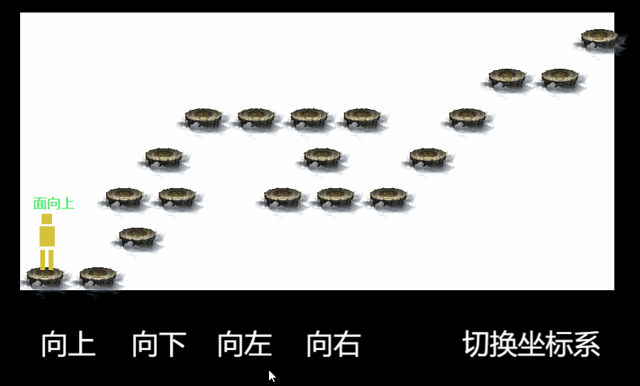

# Coordinate 坐标系辅助工具

包含 `Coordinate` `CoordinateItemRect` `CoordinatePeopleTool` 三个核心类。  

`Coordinate` 负责接收宽高和行列数，按直角坐标系或45度角坐标系两种类型，生成棋盘数据；  
`CoordinateItemRect` 即为单个棋盘格子，带有位置尺寸等数据，并提供一些诸如获取邻居等辅助方法；  
`CoordinatePeopleTool` 为在棋盘上运动的辅助类，触发后内部会由 emit 通信返回目标格子。  

```typescript
export default class MainPeople extends cc.Component {
    onLoad() {
        this.node.on('move', this._handleMove, this);
        this.node.on('face', this._handleFaceChange, this);

        // 初始化棋盘数据
        const { width, height } = this.node;
        this.coordinate = this.coordinate || new Coordinate(width, height);
        this.coordinate.init(5, 6, AngleType.FiftyFiveAngle);

        // 初始化棋盘运动工具
        this.mapTool = new CoordinatePeopleTool();
        this.mapTool.coordinate = this.map.coordinate;
        this.mapTool.emit = this.node.emit.bind(this.node);

        // 棋盘元素绘制部分
        const rects = this.coordinate.getWholeRects();
        rects.forEach((rect: CoordinateItemRect) => {
            const { x, y } = rect.getCenterPoint();
            // ...
        });

        // 触发运动
        this.mapTool.moveUp();
    }

    // 自定义运动动画
    _handleMove(rect: CoordinateItemRect, withAnim = true) {
        const { x, y } = rect.getCenterPoint();
        if (!withAnim) return this.node.setPosition(x, y);
        else cc.tween(this.node).to(this.moveSpeed, { x, y }).start();
    }
}
```


